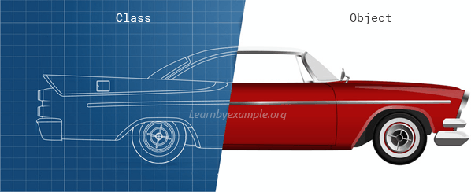

# Prototypal Inheritance and Classes in Javascript

## What is OOP

One of the main programming paradigms is called "Object Oriented Programming". Many languages are either built to specifically for this paradigm (Java, C++) or allow you to easily implement OOP principles (Ruby, Python). In OOP you model your system as a "collection of objects, where each object represents some particular aspect of the system" <sup>1</sup> In other words we create a series of `Classes` which represent real world things. You then create instances of these classes, or objects, that have a public interface to other code but can maintain its own private internal state. For example, in a grading system we may have a Class that represents a Student, a class for the Instructor and a class for individual Assignments. Classes are like the blueprint and objects are like the individual items based on that blueprint.



## Inheritance

A major feature of OOP is inheritance. Inheritance allows us to create super classes that have shared features with their child classes. This allows us to create class hierarchies. For example, we might have a Vehicle class that has attributes like `wheels`, `registrationNumber` and `owner` but we could then have a `Car` class that inherits from `Vehicle` but has an attribute `numberOfDoors` and always has `wheels` set to 4.

## Inheritance in Javascript

Javascript did not originally have Classes. Instead Javascript uses something called Prototypes for inheritance. In Javascript, everything that is not a primitive, is an object. Primitive values are

- String
- Number
- Bigint
- Boolean
- Null
- undefined
- Symbol

Everything else is an object. But what about arrays and functions? Well, technically those are still objects.While it’s a little strange to think of functions as an object, just consider an object the basic building block of anything that isn’t “primitive” in javascript. i.e. anything that isn’t one of the above datatypes.

**Further, every object (with a couple of exceptions) in Javascript has a second object associated with it called a prototype. Objects inherit properties from their prototype.**

## this

The `this` keyword in Javascript has different meaning depending on where its used, however on objects, it refers to the current object.

## Constructor Functions vs. Factory Function

A factory function, is just a function that returns an object.

```js
function student(name, grade) {
  return { name: name, grade: grade };
}
benny = student('Benny', 'A+');
```

A constructor function is invoked using the new keyword, which creates a new object, and calls the constructor function passing the new object as `this`.

```js
function Student(name, grade) {
  this.name = name;
  this.grade = grade;
}
julie = new Student('Julie', 'C-');
```

## Sources

<sup>1</sup>[MDN OOP Article](https://developer.mozilla.org/en-US/docs/Learn/JavaScript/Objects/Object-oriented_programming)
<sup>2</sup>Image from [Learn by Example](https://www.learnbyexample.org/python-classes-and-objects/)
